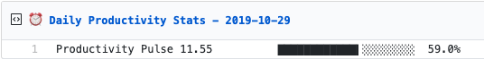

  
  <h3 align="center">rescue-box</h3>
  
Update a pinned gist to contain your daily RescueTime stats

---

> 📌✨ For more pinned-gist projects like this one, check out: https://github.com/matchai/awesome-pinned-gists

## Setup

### Prep work

1. Create a new public GitHub Gist (https://gist.github.com/)
1. Create a token with the `gist` scope and copy it. (https://github.com/settings/tokens/new)
1. Create a RescueTime Account account (https://rescuetime.com)
1. In your account settings, create a new RescueTime API Key (https://www.rescuetime.com/anapi/manage)

### Project setup

1. Fork this repo
2. Edit the [environment variable](https://github.com/joshghent/rescue-box/blob/master/.github/workflows/schedule.yml#L13-L15) in `.github/workflows/schedule.yml`:

   - **GIST_ID:** The ID portion from your gist url: `https://gist.github.com/joshghent/`**`2d5f82ddf12683b47fc27f987a561d03`**.

3. Go to the repo **Settings > Secrets**
4. Add the following environment variables:
   - **GH_TOKEN:** The GitHub token generated above.
   - **RESCUETIME_API_KEY:** The API key for your RescueTime account.
5. Copy the contents of `.github/workflows/schedule.yml`, then delete the file and commit it. Then recreate the file and paste the contents back in (this is due to forked repos not running actions)
